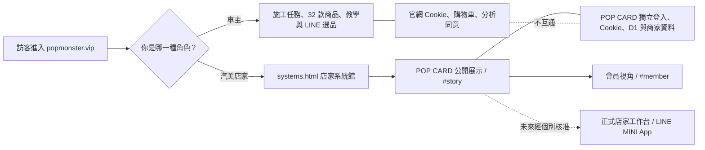

# 泡泡怪獸宇宙：公開入口與系統邊界

## 現在共享

- 品牌名稱與黑金視覺語言。
- 「先看情境，再進正確工具」的導流邏輯。
- 可回到官方站的清楚入口。

## 現在不共享

- 登入、Session、Cookie 或 analytics consent。
- 官網會員、購物車、訂單與付款狀態。
- POP CARD 會員、車輛、預約、施工、儲值、帳本或 D1 資料。

## 未來才評估

共用 LINE 身分、正式商家 onboarding、跨系統帳號或資料同步，都必須先完成產品、個資、安全與遷移決策，不包含在本次公開入口整合。
